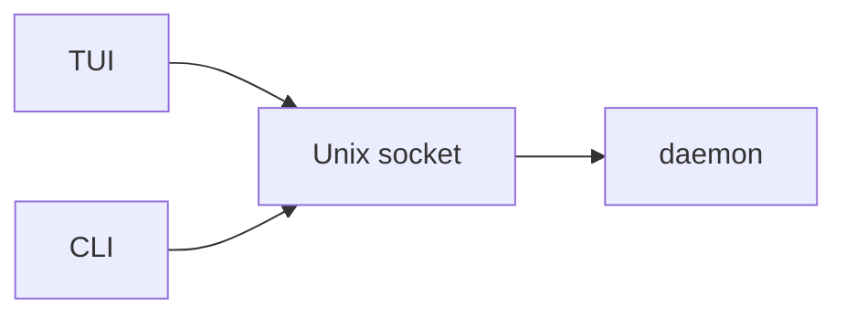

# ADR-001: One long-running process, clients that only attach

**Date**: 2026-10-05
**Status**: accepted

## The idea

Work should keep going after you close the program that showed it. A second program should be able to attach to the same work.

There is one process per user. Call it the daemon. It owns the files, the settings, and the log. Every other program is a client. A client connects, reads what happened, and sends commands. It does not store the work itself.

The socket is a file, `run/golem.sock`, inside the home directory. Its mode is `0600`: only your user can open it. That permission is the login check. There is no account system.

The home directory is the one `resolve_paths` picks, usually `~/.golem`. [architecture.md](../architecture.md) walks through that choice.

## What the code does today

`python -m golem serve` listens on `GolemPaths.socket_path`, `<home>/run/golem.sock`, mode `0600`. Clients are the TUI and `golem status`. Both use `@golem/client`. They send commands and read JSON lines. They do not store the work.

`DaemonLock` holds `run/golem.pid` for the life of the process. [ADR-004](004-pid-lock.md) is that lock. `golem daemon install` writes the launchd plist that starts `python -m golem serve` at login and again after a crash.

The home directory, `load_settings`, and `configure_logging` live in the `golem` package.

## Other shapes that lost

Putting the work inside the TUI process means closing the terminal kills the work. A second program cannot attach.

An HTTP server on localhost needs its own password. A socket file with mode `0600` is already limited to your user.

A hosted graph server would keep the files and the permission checks off this machine.

## What it costs

A client cannot call Python functions. Anything it needs has to cross the message shapes in [ADR-003](003-protocol.md).

A crash leaves the socket file in place. [ADR-004](004-pid-lock.md) is how the next start tells a dead file from a live one.
