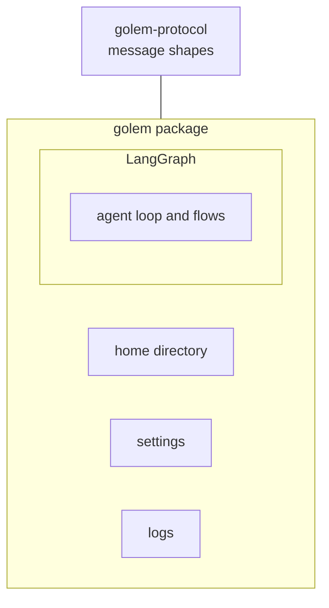

# ADR-002: The graph library only runs graphs

**Date**: 2026-10-05
**Status**: accepted

## The idea

LangGraph is the library chosen to run an agent loop and a long flow: stop, resume, stream tokens, retry a step. It is not a dependency of this repository. Nothing imports it.

The rule is small. The library runs a graph. Our packages own everything around the graph.

A graph may call our functions. It does not become the place where message shapes, settings, or logs are defined. Those already have packages.

Graph state stays small. A big tool result belongs in our own store. The graph keeps an id and a short summary.

When graph code is added, two styles stay separate:

- **Agent.** The model picks the next step. One graph, with different settings per session.
- **Flow.** Our Python picks the next step. A step that costs money or changes the disk is saved, so a resume does not run it again.

A step that stops for a person runs again from its first line when it resumes. A side effect goes after that stop, or in its own step, so it does not happen twice.

## What the code does today

No `pyproject.toml` depends on LangGraph. There is no graph module.

The split is already visible as packages. Message shapes are `golem_protocol`. The home directory, settings, and logs are `golem`. The TypeScript package imports generated types and does not import Python.

## Other shapes that lost

Making the whole program a graph means a message shape, a permission rule, and a budget become checkpoint fields. Swapping the library later means rewriting those.

Writing our own loop means rebuilding stop and resume.

Putting permission rules inside the graph ties a policy edit to old checkpoints. The same rules also have to cover work that did not start inside that graph.

## What it costs

The graph's thread id and our session id have to be the same string, once both exist. The repository has neither store yet.

Each new piece of code has to sit on one side of the line: inside a graph, or in a golem package.
