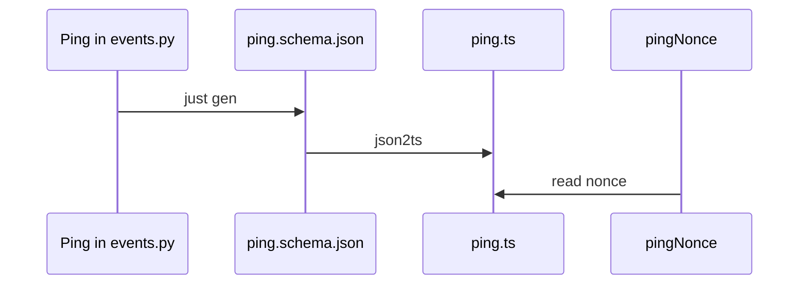

# ADR-003: One Python model, generated TypeScript

**Date**: 2026-10-05
**Status**: accepted

## The idea

The daemon and the TUI have to agree on message shapes. Those shapes are written once, in Python. TypeScript is generated. A hand edit to the TypeScript would be overwritten, and `just check` would fail if someone forgot to regenerate.

On the wire, once a socket exists, each line is one JSON-RPC 2.0 object. Events go from the daemon to the client. Commands go from the client to the daemon.

An event is a fact that already happened. The client builds its screen by reading the facts in order. It does not keep a second, private copy of the session.

The walk with the real model is in [architecture.md](../architecture.md).

## What the code does today

`Ping` in `golem_protocol.events` is the only model.

| Field | Rule |
|---|---|
| `type` | the string `system.ping` |
| `nonce` | a string |

`just gen` writes `packages/protocol/gen/ping.schema.json` and `ping.ts`. Both are committed. `packages/tui/src/index.ts` imports `Ping`. `pingNonce` returns the nonce. A nonce of `abc` comes back as `abc`.

`PROTOCOL_MAJOR` is `1`. `PROTOCOL_MINOR` is `0`. They are constants in `golem_protocol/version.py`. No function compares a client's version to them.

No socket is opened, so no JSON-RPC line is sent.

## Other shapes that lost

Sending the graph library's own chunks to the TUI would make the screen depend on that library's classes.

Writing the TypeScript by hand would let the two sides drift. The bug would show up as a wrong screen. Here it shows up as a failed `just check`.

Using AG-UI or ACP as the native message format is not decided. This record does not pick either one.

## What it costs

Something still has to turn a graph library's stream into these models, and turn a person's answer back into a resume. That translator is not in the tree.

`json-schema-to-typescript` is locked in `pnpm-lock.yaml`. Two machines generate the same `ping.ts`.

A breaking change to a model bumps `PROTOCOL_MAJOR`. The daemon is supposed to refuse a client on the wrong major number. Nothing performs that check yet.
