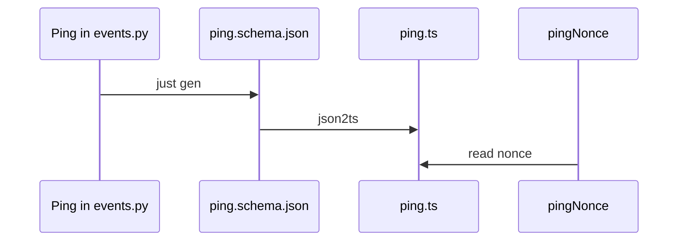

# ADR-003: One Python model, generated TypeScript

**Date**: 2026-10-05
**Status**: accepted

## The idea

The daemon and the TUI have to agree on message shapes. Those shapes are written once, in Python. TypeScript is generated. A hand edit to the TypeScript would be overwritten, and `just check` would fail if someone forgot to regenerate.

On the wire, once a socket exists, each line is one JSON-RPC 2.0 object. Events go from the daemon to the client. Commands go from the client to the daemon.

An event is a fact that already happened. The client builds its screen by reading the facts in order. It does not keep a second, private copy of the session.

The walk with the real model is in [architecture.md](../architecture.md).

## What the code does today

The daemon speaks these models. `just gen` writes a JSON Schema and a TypeScript file for each one, plus `version.ts` from `PROTOCOL_MAJOR` and `PROTOCOL_MINOR`.

| Model | Role |
|---|---|
| `HelloParams`, `HelloResult` | `hello`. The major number must match. Any minor on that major is accepted. |
| `DaemonStatus` | Result of `daemon.status`: pid, version, protocol, uptime, `running` or `draining`. |
| `PingParams`, `Ping` | `ping`. The daemon echoes `nonce` on a `system.ping` result. |
| `SessionCreateParams`, `SessionCreateResult` | `session.create`. Returns `session_id`. |
| `MessageSendParams`, `MessageSendResult` | `message.send`. Returns `run_id` while the run continues. |
| `ChatEvent` | One of `session.created`, `message.started`, `message.delta`, `message.completed`, `run.started`, `run.completed`, `run.failed`. |
| `RpcRequest`, `RpcSuccess`, `RpcFailure` | One JSON-RPC 2.0 object per line. A request has an `id`. |
| `RpcNotification` | Method `event`, params `ChatEvent`, no `id`. |

`PROTOCOL_MAJOR` is `1` and `PROTOCOL_MINOR` is `1`. The chat commands and the event notification are that minor. `hello` runs before the other commands. A different major number is error `-32001`, and the client stops reconnecting. A missing session is `-32003`, a second send while a run is open is `-32004`, and a model with no provider, name, or key is `-32005`. `@golem/client` imports the generated types and dispatches `event` lines to listeners. Those lines do not settle a pending `ping`. `pingNonce` in the TUI still reads a `Ping` nonce. The screen is the chat, plus the connection line.

## Other shapes that lost

Sending the graph library's own chunks to the TUI would make the screen depend on that library's classes.

Writing the TypeScript by hand would let the two sides drift. The bug would show up as a wrong screen. Here it shows up as a failed `just check`.

Using AG-UI or ACP as the native message format is not decided. This record does not pick either one.

## What it costs

`json-schema-to-typescript` is locked in `pnpm-lock.yaml`. Two machines generate the same TypeScript.

A breaking change to a model bumps `PROTOCOL_MAJOR`. `hello` refuses a client on the wrong major number.

`golem/graphs/adapter.py` turns a graph stream into `message.delta` and `message.completed`. The session manager emits the user `message.completed`, `message.started`, and the `run.*` events. The socket carries `hello`, `daemon.status`, `ping`, `session.create`, `message.send`, and `event` notifications. A person's answer during a paused step is not in the tree yet.
