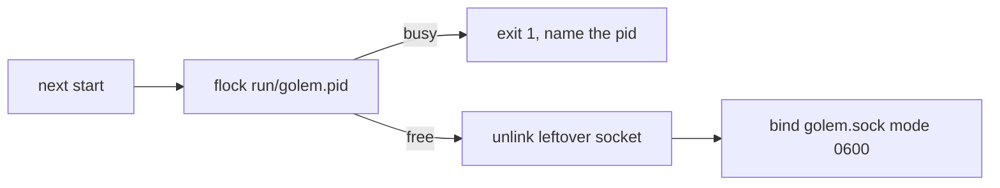

# ADR-004: A flock on the pid file owns the socket

**Date**: 2026-10-06
**Status**: accepted

## The idea

A crash leaves `run/golem.sock` behind. The next start has to delete that file, and it has to refuse to delete it when a daemon is actually listening.

The lock is `fcntl.flock` on `run/golem.pid`, held until the process exits. The file also stores the pid, so a second start can say which process has the socket. The flock is the lock. A pid check is not: the operating system reuses pid numbers.

## What the code does today

`DaemonLock` in `golem/lock.py` opens `run/golem.pid`, takes a non-blocking exclusive flock, and writes the pid. The file mode is `0600`. `DaemonApp.serve` unlinks a leftover socket only after that lock is held, then binds `run/golem.sock` with mode `0600`.

A second `python -m golem serve` exits 1 with `daemon already running (pid N)`. SIGTERM drains in-flight handlers, unlinks the socket, and releases the lock. A kill drops the flock when the process dies, and the next start removes the stale socket.

## Other shapes that lost

`kill(pid, 0)` asks whether a pid is alive. After a crash the number can belong to a different process. That check would refuse to start, or would unlink a live socket.

`SO_REUSEADDR` does not clear a Unix socket file. The file has to be removed by the process that holds the lock.

## What it costs

Two homes can each run a daemon. One home cannot. The server acquires the lock once per process. On macOS a second flock in the same process converts the lock instead of failing, so tests that check exclusion start a second process.

[ADR-001](001-process-split.md) is the socket. This record is how a dead socket file is told from a live one.
