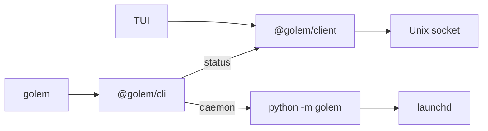

# ADR-005: One TypeScript client, and that client owns the golem command

**Date**: 2026-10-06
**Status**: accepted

## The idea

The TUI and `golem status` speak to the daemon through one library, `@golem/client`. A second implementation would drift, and the bug would show up as a status line that lies.

Process control stays in Python. launchd has to run an absolute interpreter: `python -m golem serve`. The command a person types is still `golem`. That binary is TypeScript. `golem status` uses the client. `golem daemon install|start|stop|logs` starts `uv run python -m golem daemon …`.

## What the code does today

`@golem/client` connects, sends `hello`, and pings every 5 seconds. A missed ping drops the socket. The TUI reconnects with backoff from 200 ms up to 5 s. `golem status` tries once and exits 1 if nothing is listening. A protocol major mismatch stops the retries.

The TUI is Ink 8 and React 19. The screen is one line: `connected`, `reconnecting`, or the mismatch reason. That line is a function of the client state. `ink-testing-library` does not support this Ink, so the test checks the function. It does not render a frame.

## Other shapes that lost

A Python client for `golem status` would be a second reader of the same JSON. The TUI would not use it.

A Python console script also named `golem` would fight the TypeScript bin on `PATH`.

Ink 5 with `ink-testing-library` would pin the TUI to React 18. The status line does not need that, and the chat view in a later phase would have to migrate.

## What it costs

`golem daemon install` records the current virtualenv interpreter in the plist. Moving the checkout means running install again. The daemon subcommands need `uv` on `PATH`.

The status line is tested without drawing Ink. A later phase can render components when a test library matches the Ink version.
