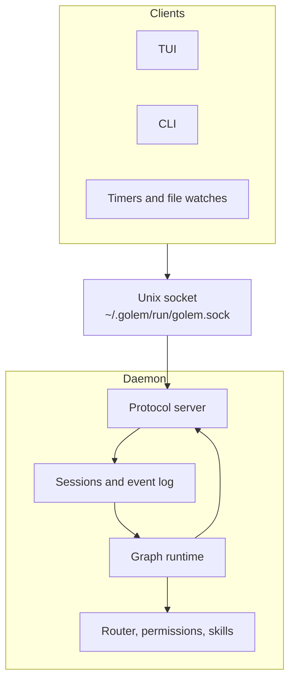
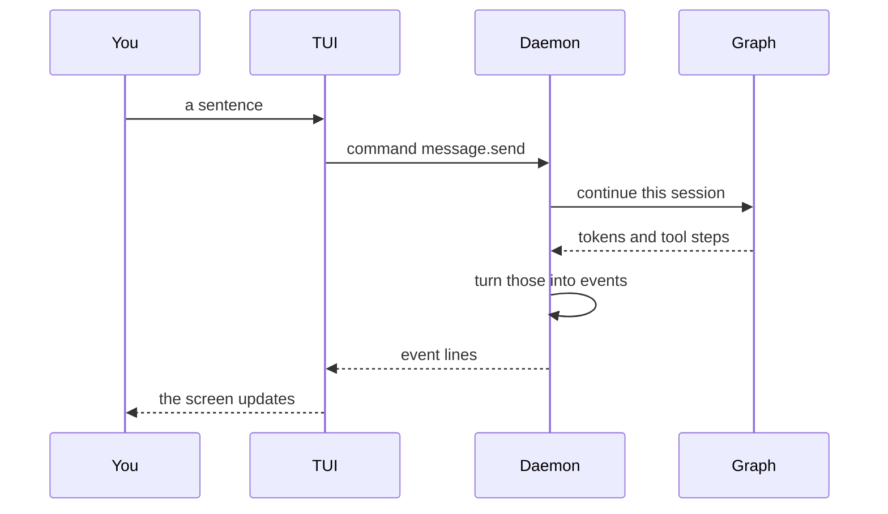
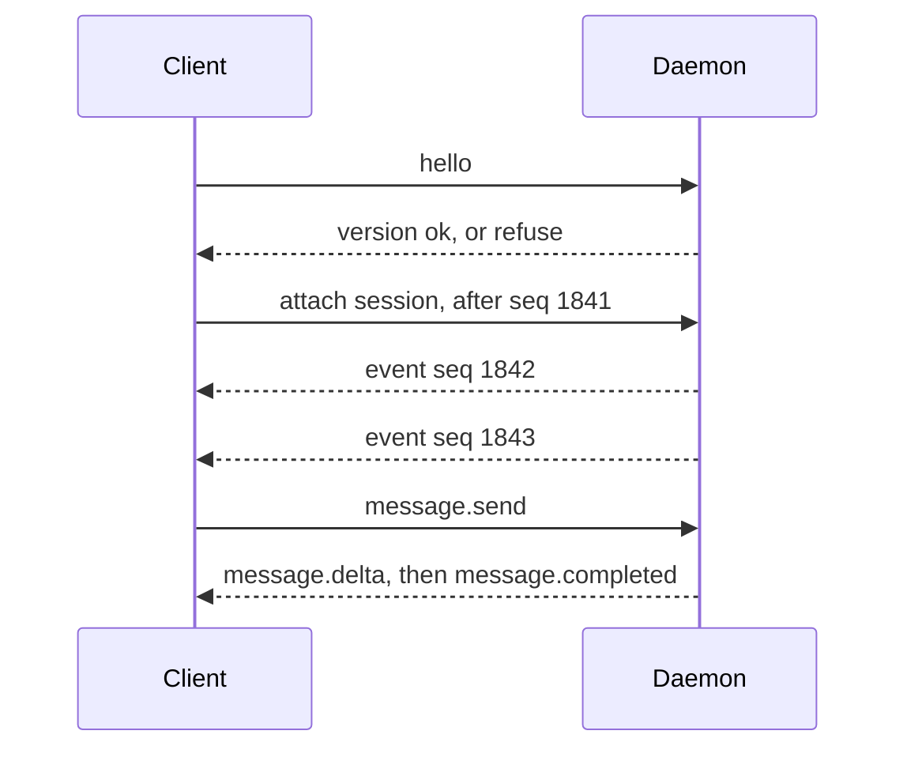

# Architecture

Golem is one long-running program, and several clients that attach to it. This file explains those pieces: the daemon, the protocol, and why they are separate.

The choice behind each piece is in [adr/](adr/README.md). How the Python and TypeScript trees share one repository is in [monorepo.md](monorepo.md).

## The short version

The **daemon** is the process that does the work. It keeps running after you close a terminal. Chats, tool calls, and long flows live there.

A **client** attaches to that work. The TUI, a headless command, and a timer are all clients. A client does not store the chat. It connects, catches up, and sends commands.

The **protocol** is the only language between them. The daemon is Python. The TUI is TypeScript. They do not share objects. They share message shapes, written once and generated for both sides.

Inside the daemon, a graph library runs the agent loop. That library never speaks to a client. An adapter turns its stream into protocol events first.

## The daemon

One daemon per user. It starts when you log in, and launchd starts it again if it crashes. Closing the TUI does not stop it. That is the point: a chat can finish, or wait for your approval, while the TUI is closed.

Clients reach it through a Unix socket at `~/.golem/run/golem.sock`. The file mode is `0600`, so only your user can open it. That permission is the login check. There is no account and no password. `run/golem.pid` is the lock that lets a restart delete a socket left behind by a crash. [ADR-004](adr/004-pid-lock.md) is that lock.

A client is stateless. It connects, sends commands, and listens. The commands that run today are `hello`, `daemon.status`, and `ping`. Sessions and the event log come later. The daemon will hold them, and a client will catch up by asking for the events it missed.

### What the daemon owns

The socket is only the door. Behind it, four jobs sit in one process:

| Job | What it does |
|---|---|
| Protocol server | Reads one JSON line at a time. Runs the command. Writes events back. |
| Sessions | One chat or one flow run. Each has an id and a growing list of events. |
| Event log | The history. A client that reconnects reads it and rebuilds the screen. |
| Graph runtime | The agent loop, and flows whose steps are saved so a crash can resume. |

The graph does not own the rest of the product. It calls ordinary Python for three things that have to stay ours:

- **Which model** answers this step, and whether the budget allows it.
- **Whether a tool may run.** Every side effect, including ones from a flow or a skill, asks the same permission check.
- **Which skills** are active. A skill is a `SKILL.md` the model can be given. The registry lives in the daemon.

LangChain message objects stay inside the graph. The protocol server never sends them out. [ADR-002](adr/002-langgraph-boundary.md) is that boundary.

### One turn

You type in the TUI. The daemon is the only place the model runs.

The same events are appended to that session's log. If you quit the TUI halfway through, the daemon keeps going. When you open it again, it sends `attach` with the last sequence number it saw, and the daemon replays everything after that. The screen comes back from the log. The TUI does not have its own copy of the chat.

Two graphs, on purpose. In an **agent** session, the model picks the next step. In a **flow**, our Python picks the next step, and each expensive step is saved so a resume does not run it again.

A step that stops to ask you a question runs again from its first line when you answer. The side effect goes after that stop, or in its own step, so a resume does not do it twice.

### Files on disk

The daemon keeps its files under one home directory. `resolve_paths` picks it: a function argument, otherwise `GOLEM_HOME`, otherwise `~/.golem`.

| Path | Role |
|---|---|
| `run/golem.sock` | The socket clients connect to |
| `run/golem.pid` | The lockfile. The daemon holds a flock on it and writes its pid |
| `golem.db` | Sessions, the event log, runs, costs |
| `checkpoints.db` | Where the graph runtime saved its steps. Separate so it can be wiped without deleting the event log |
| `memory.db` | Long-term memory |
| `config.toml` | Settings for this user |
| `logs/golem.jsonl` | The daemon's own log, one JSON object per line |
| `skills/`, `flows/` | Skills and flows you added on this machine |

A project can also have `<project>/.golem/config.toml`. That file overrides the home file. `GOLEM_LOG_LEVEL` overrides both. An explicit `log_level` on the call overrides the environment. The only setting loaded today is `log_level` (`DEBUG`, `INFO`, `WARNING`, `ERROR`).

Each log record is written twice: a short line on stderr, and a JSON line in `logs/golem.jsonl`. Loggers named `golem.…` flow up to the `golem` logger.

## The protocol

The protocol exists so a client never has to understand the daemon's insides.

The TUI is TypeScript. The daemon is Python. A graph library in the middle has its own message classes, and those classes change. If the TUI spoke those classes, every client would be tied to that library, and a reconnect would have no stable history to read.

So the daemon translates. What crosses the socket is our messages only.

### Two directions

**Commands** go from client to daemon. They ask for something: open a session, send a sentence, approve a tool, cancel a run, list flows.

**Events** go from daemon to client. They report something that already happened: a token arrived, a tool finished, a model was chosen, a run stopped.

An event is a fact. The client builds the whole screen from the facts, in order. Replay is not a special mode. It is the same stream, read from the start or from the last number the client has.

`hello` is the first command. The client and the daemon compare protocol versions. `PROTOCOL_MAJOR` is `1` and `PROTOCOL_MINOR` is `0`. A break in the shapes bumps the major number, and the daemon refuses the client. Any minor on the same major is accepted. After `hello`, the client sends `ping` every few seconds so a half-open socket is noticed, and `daemon.status` when it wants the pid and uptime.

Each event line is one JSON-RPC 2.0 notification. The fields that matter:

| Field | Meaning |
|---|---|
| `seq` | A rising number for this session. The client uses it to ask for "everything after here". |
| `session_id` | Which chat or flow |
| `run_id` | Which execution, when a session can have more than one |
| `type` | What happened, such as `message.delta` |
| `data` | The payload for that type |

`message.delta` is the live token stream. The copy saved in `golem.db` keeps `message.completed` instead, so the database does not store every fragment.

### Why a protocol package

Those shapes are written once, as Python classes in `golem_protocol`. `just gen` writes JSON Schema, then TypeScript, into `packages/protocol/gen/`. The TUI imports the generated types. A hand-written TypeScript copy would drift, and the bug would show up as a wrong screen. Here `just check` fails if the generated files do not match the classes.

The same pipeline is what a real event uses. Add a class, run `just gen`, and the client sees a typed payload. The socket code speaks those types. It does not invent a second schema.

The models on the wire today are `hello`, `daemon.status`, and `ping` (the `Ping` event is the ping result: `type` is `system.ping`, `nonce` is a string). `@golem/client` imports the generated types. The TUI and `golem status` both use that client. `packages/tui/src/index.ts` still exports `pingNonce`, which returns `event.nonce`.
