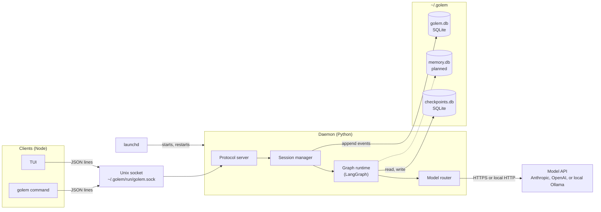
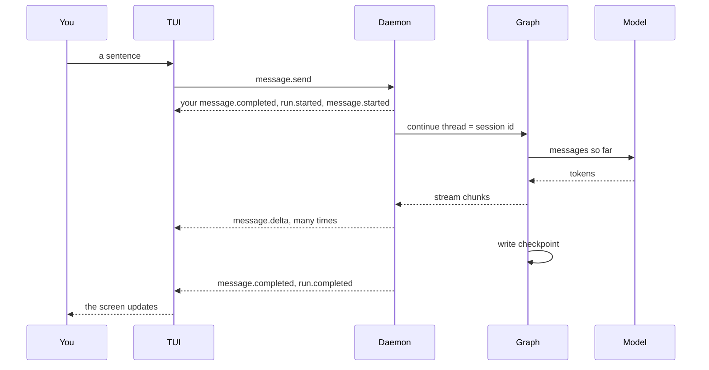
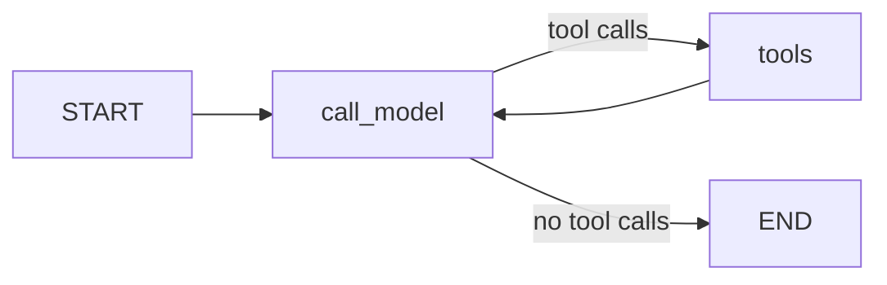
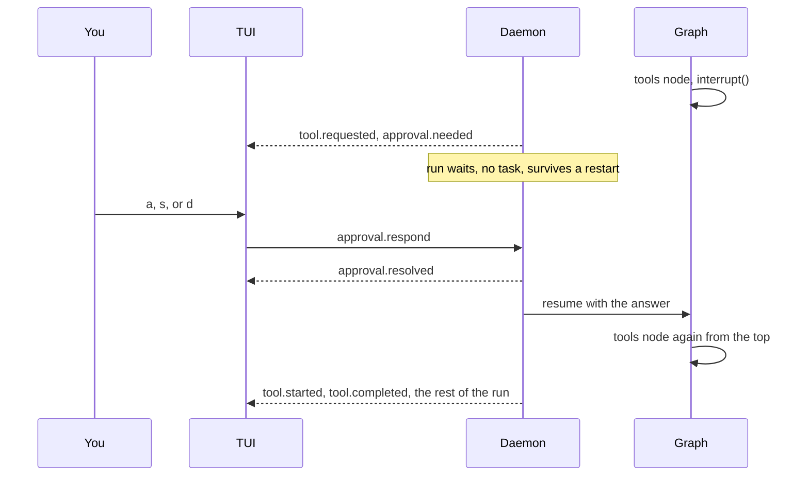
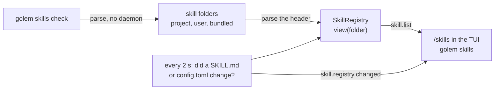
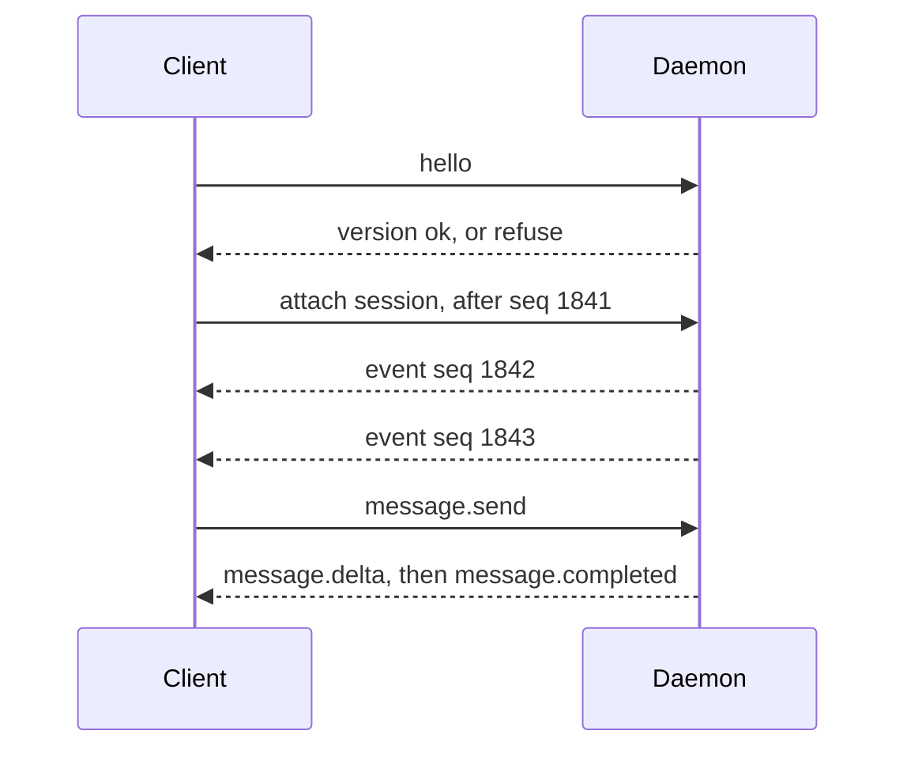
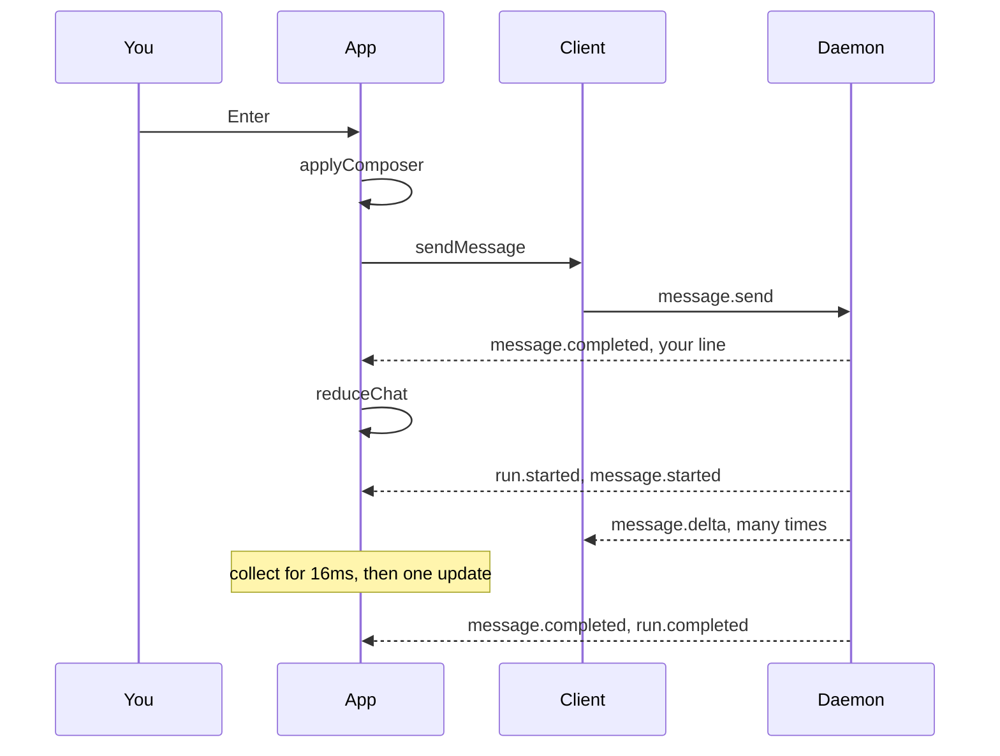
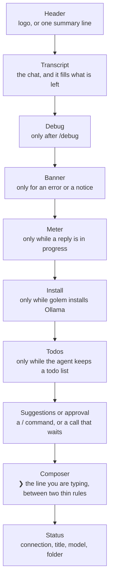
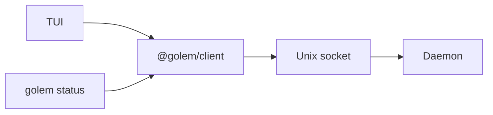

# Architecture

*First the body, set in a circle and a square. The street, the socket, and the screen are built around that figure.*

Golem is one long-running program, and several clients that attach to it. This file explains those pieces in plain words: the daemon, the clients, the protocol between them, the screen, and where the data lives.

The choice behind each piece is in [adr/](adr/README.md). How the Python and TypeScript trees share one repository is in [monorepo.md](monorepo.md).

 

## The short version

The **daemon** is the process that does the work. It keeps running after you close a terminal. Chats, tool calls, and long flows live there. The model is only ever called from the daemon.

A **client** attaches to that work. The TUI and the `golem` command are clients today. A timer or a file watch will be one later. A client connects, sends commands, and draws the events it receives. It does not hold the model's memory. The screen itself is [the last chapter](#the-tui). The choices behind it are in [ADR-005](adr/005-client-package.md).

The **protocol** is the only language between them. The daemon is Python. The clients are TypeScript. They do not share objects. They share message shapes, written once and generated for both sides.

## Words used here

| Word | Meaning |
|---|---|
| Daemon | The one background Python process per user. It owns the files and runs the model. |
| Client | Any program that connects to the daemon's socket. It sends commands and reads events. |
| Session | One chat, or later one flow. It has an id. |
| Run | One answer inside a session: from the sentence you send until the model stops. |
| Command | A request from a client to the daemon, such as `message.send`. |
| Event | A fact the daemon reports back, such as `message.delta`. |
| Checkpoint | The model's saved memory for a session, stored after each step. |
| Graph | The agent loop. A LangGraph library call inside the daemon, not a separate service. |
| Flow | A graph whose steps our Python picks, and whose expensive steps are saved. Planned. |
| Skill | A folder with a `SKILL.md`: what one job is for, and how to do it. Found and listed today; used by the model next. |

## The system on one machine

Everything runs on your machine, except the model when you pick a remote provider. There are two kinds of process: one daemon, and any number of clients.

```mermaid
flowchart LR
  launchd["launchd"]
  subgraph clientProcs ["Clients (Node)"]
    tui["TUI"]
    cli["golem command"]
  end
  sock["Unix socket<br>~/.golem/run/golem.sock"]
  subgraph daemonProc ["Daemon (Python)"]
    server["Protocol server"]
    sessions["Session manager"]
    runtime["Graph runtime<br>(LangGraph)"]
    router["Model router"]
  end
  subgraph disk ["~/.golem"]
    ckpt[("checkpoints.db<br>SQLite")]
    golemdb[("golem.db<br>SQLite")]
    memdb[("memory.db<br>planned")]
  end
  model["Model API<br>Anthropic, OpenAI, or local Ollama"]
  launchd -->|"starts, restarts"| daemonProc
  tui -->|"JSON lines"| sock
  cli -->|"JSON lines"| sock
  sock --> server
  server --> sessions
  sessions --> runtime
  runtime --> router
  runtime -->|"read, write"| ckpt
  router -->|"HTTPS or local HTTP"| model
  sessions -->|"append events"| golemdb
  runtime -.-> memdb
```

What talks to what, and how:

- **Client to daemon.** A Unix socket file. Each line is one JSON-RPC 2.0 object. No network port is opened.
- **Inside the daemon.** Ordinary Python calls in one asyncio process. A run is an asyncio task. The graph is a library the session manager calls. It is not a second process.
- **Daemon to model.** HTTPS to Anthropic, OpenAI, or a hosted OpenAI-compatible API such as OpenRouter, or plain HTTP to Ollama's native API or a local OpenAI-compatible server. The model router resolves each session's model name to one of them.
- **Daemon to disk.** SQLite files under `~/.golem`. `checkpoints.db` is written by LangGraph's SQLite checkpointer. `golem.db` is ours: the event log and the session and run tables, through one `aiosqlite` connection.
- **Who starts what.** launchd starts the daemon at login and again after a crash. You start the clients.

## Built today, planned next

Built today:

- The daemon, its socket, the pid lock, and the launchd job.
- `@golem/client`, the TUI, and `golem status`.
- Chat sessions. Each one runs a single agent graph against the model it stored when it was created.
- Checkpoints in `checkpoints.db`. They survive a daemon restart. [ADR-006](adr/006-checkpoint-continuity.md) is that choice.
- The event log in `golem.db`. Every event is written there before it goes to the socket, so sessions, runs, and `seq` survive a restart. A run left open by a stopped daemon is closed at the next start.
- `session.attach`. A client gets the stored events after the last `seq` it saw, then the live ones. Any number of clients can follow one session. The TUI opens the newest session in its working folder at startup, or a new one there. [ADR-007](adr/007-attach-and-fan-out.md) is that choice.
- `run.cancel`, and Ctrl-C in the TUI. A cancelled answer keeps what it said. [ADR-008](adr/008-cancellation.md).
- Titles, a live session list, and the TUI switcher (`/sessions`, `/new`, `/title`). [ADR-009](adr/009-session-list.md).
- `session.fork` and `/fork`. A new session with the history up to one message. [ADR-010](adr/010-fork.md).
- Read-only tools: `read_file`, `list_dir`, `glob`, and `grep`, inside the session's project folder, and inside the folder of each skill the session ran. [ADR-011](adr/011-tools.md), [ADR-030](adr/030-skill-read-roots.md).
- `web_fetch`: one page as text, asked per host, never from a private address. [ADR-017](adr/017-web-fetch.md).
- Artifacts: tool output over 20 000 characters in `golem.db`, read in pages with `read_artifact` and `artifact.read`. [ADR-016](adr/016-artifacts.md).
- Write tools: `write_file` and `edit_file`, inside the session's project folder and outside its `.golem/` and `.git/`, with the diff in the approval. [ADR-015](adr/015-write-tools.md).
- A sandboxed `shell`, with streamed output, and the read-only `git_status`, `git_diff`, and `git_log`. [ADR-014](adr/014-shell-sandbox.md).
- Tool rules: allow, ask, or deny per tool, subject, and path, from `config.toml` and a project's `.golem/policy.toml`, and `golem config show`. [ADR-012](adr/012-permission-rules.md).
- "Always allow" from the approval band, and `/permissions` to change, delete, or revoke rules and session allowances.
- Approvals: a call a rule asks about pauses the run until you answer in the TUI, across a TUI close or a daemon restart. [ADR-013](adr/013-approvals.md).
- An agent todo list: `todo_write`, `todos.updated`, and the todo band. [ADR-018](adr/018-tool-state-updates.md).
- MCP servers over stdio or HTTP, from `[mcp.<name>]` in the user's file or a trusted project's. Their tools are `mcp__<server>__<tool>`, ask before every call, and reach the model marked as data. A server is on for every session, on demand per session (`/mcp enable`), or off. Servers restart with backoff when they exit or stop answering `ping`, and pick up config changes without a daemon restart. Tokens come from the Keychain as `keychain:mcp/<name>`. [ADR-023](adr/023-mcp-client.md).

- Skills: `SKILL.md` folders from the project, the user, and golem, checked, listed with `/skills`, `golem skills`, and `skill.list`, and reloaded within two seconds of a change. `/name` runs one, and the model may then read its folder. Pinning one and letting the model pick one come next. [ADR-025](adr/025-skill-sources.md), and [Skills](#skills) below.

Planned next:

- Running, pinning, and loading skills, then flows and long-term memory in `memory.db`.

## The daemon

*Like the golem of Prague, the daemon keeps working through the night while its master is away.*

One daemon per user. It starts when you log in, and launchd starts it again if it crashes. Closing the TUI does not stop it. That is the point: a chat can finish, or wait for your approval, while the TUI is closed.

Clients reach it through a Unix socket at `~/.golem/run/golem.sock`. The file mode is `0600`, so only your user can open it. That permission is the login check. There is no account and no password. `run/golem.pid` is the lock that lets a restart delete a socket left behind by a crash. [ADR-004](adr/004-pid-lock.md) is that lock.

 

### What the daemon owns

The socket is only the door. Behind it, these jobs sit in one process:

| Job | What it does | Status |
|---|---|---|
| Protocol server | Reads one JSON line at a time. Runs the command. Queues the reply, and the events of attached sessions, for that connection. | Built |
| Sessions | One chat or one flow run. Each has an id and a row in `golem.db`. | Built |
| Graph runtime | The agent loop. Its memory is the checkpoint. | Built |
| Model router | Resolves a profile name or `provider/model` ref to a chat model. | Built |
| Tools | Plain Python functions with a Pydantic argument model, in `golem/tools/`. The graph offers them to the model and runs them in its own `tools` node. | Built: file reads and writes, `shell`, git, `web_fetch` |
| MCP servers | Child processes or HTTP endpoints from `[mcp.<name>]`, started in the background, watched with `ping`, and restarted with backoff. Each session's tools come from `ToolRegistry.scoped` (`golem/mcp/`). | Built |
| Permissions | Rules from the project, the user, and the defaults, checked in order before every tool call (`golem/permissions/`). | Built |
| Skills | The `SKILL.md` folders a session's folder sees, and which one each name means (`golem/skills/`). | Built: finding, listing, and running by name. Pinning planned |
| Event log | The history. Every event, numbered by `seq`, written before it is sent. A client that reconnects will read it and rebuild the screen. | Written. Replay to clients planned |

The graph does not own the rest of the product. It calls ordinary Python for three things that have to stay ours:

- **Which model** answers this step, and whether the budget allows it.
- **Whether a tool may run.** Every tool call asks the same permission check before it runs. Flows and skills will ask it too. File tools also refuse any path outside the session's project folder, whatever the rules say.
- **Which skills** exist and which are active. A skill is a `SKILL.md` the model can be given. The registry lives in the daemon, and the graph will only ever hold skill names ([Skills](#skills)).

LangChain message objects stay inside the graph. The protocol server never sends them out. An adapter turns the graph's stream into protocol events first. [ADR-002](adr/002-langgraph-boundary.md) is that boundary.

### One turn

You type in the TUI. The daemon is the only place the model runs.

```mermaid
sequenceDiagram
  participant You
  participant TUI
  participant Daemon
  participant Graph
  participant Model
  You->>TUI: a sentence
  TUI->>Daemon: message.send
  Daemon-->>TUI: your message.completed, run.started, message.started
  Daemon->>Graph: continue thread = session id
  Graph->>Model: messages so far
  Model-->>Graph: tokens
  Graph-->>Daemon: stream chunks
  Daemon-->>TUI: message.delta, many times
  Graph->>Graph: write checkpoint
  Daemon-->>TUI: message.completed, run.completed
  TUI-->>You: the screen updates
```

Every event in that diagram is written to `golem.db` first, then sent. The checkpoint messages carry the same message ids as the events, so the two stores name the same sentence the same way.

A turn can hold more than one model call. When the reply asks for tools, the graph runs them and calls the model again with their results:

```mermaid
flowchart LR
  startNode[START] --> callModel[call_model]
  callModel -->|"tool calls"| toolsNode[tools]
  callModel -->|"no tool calls"| endNode[END]
  toolsNode --> callModel
```

- **Messages.** Each model call is its own assistant message, with its own `message.started` and `message.completed`. The TUI draws the replies of one turn under a single `golem` label. The first one has the id the turn chose before the run. `call_model` gives each later one a new id and writes it to the graph's custom stream, and the runner opens that message. A reply that only calls tools completes with empty text.
- **Tool events.** After a reply completes, each tool call it asked for is `tool.requested`, with the asking `message_id`, the tool name, and the arguments. The `tools` node then writes `tool.started`, and `tool.completed` (a one-line summary, the first 4 KB of the output, and `artifact_id` when it was long) or `tool.failed` (the reason). Output up to 20 000 characters goes to the model as a `ToolMessage` in the checkpoint. Longer output is stored whole in the `artifacts` table, and the message keeps the first 12 000 and the last 4 000 characters and a note with the artifact's id, which `read_artifact` pages through ([ADR-016](adr/016-artifacts.md)).
- **Todos.** `todo_write` replaces the agent's todo list, which lives in graph state (`todos`) and needs no approval. A tool changes state only through `ToolResult.update`, and the `tools` node applies only the keys in `STATE_KEYS`. Each change is a `todos.updated` event with the whole list, and a fork starts with one for the list it copied ([ADR-018](adr/018-tool-state-updates.md)).
- **Failures.** A refused path, bad arguments, or an exception in a tool becomes `tool.failed`, and the model reads the same message as the result. The run goes on. A run that reaches 25 model calls fails with `the run stopped after 25 model calls`.
- **The folder.** `session.create` takes `cwd`, the TUI's working directory, and the session keeps it (`sessions.cwd`, and in `session.created`). A fork keeps its source's folder. The runner passes it to the graph in `configurable`, so it is not checkpointed. Paths resolve inside it with symlinks followed. A session made before tools has no folder. The TUI sends its working directory with each `message.send`, and such a session takes it once, stored as `session.updated` with `cwd`. After that it keeps it. A session that still has none gets the tools, and each call says it has no project folder.
- **Models without tools.** A chat model class without `bind_tools` gets no tools. A model whose server refuses tools, such as an Ollama model without the `tools` capability, is asked again without them, and that profile is not offered tools again until the daemon restarts.

If you quit the TUI halfway through, the daemon still finishes the run and saves the checkpoint. The next message in that session continues from it.

If you press Ctrl-C while the answer streams, the TUI sends `run.cancel`. The daemon cancels the run task. Each tool call still open gets `tool.failed`. The answer gets a `message.completed` with the text streamed so far and `interrupted: true`, then `run.cancelled` with the reason `user`. The same partial text is written into the checkpoint, so "go on" continues from it ([ADR-008](adr/008-cancellation.md)). Stopping the daemon does the same for every open run, with the reason `shutdown`.

`shell` runs the user's login shell (`$SHELL -lc`) in the session folder, under `sandbox-exec` ([ADR-014](adr/014-shell-sandbox.md)):
- **The sandbox** allows writes only to the folder, the temp folders, the usual tool caches, and `[shell] writable`. It denies the network unless `[shell] network = true`, except local Unix sockets. It denies reads of folders that hold credentials, `~/.ssh` and `~/.golem` among them, but allows reads of `~/.golem/skills`, so a skill can run its scripts ([ADR-030](adr/030-skill-read-roots.md)). Variables that look like credentials (`*_API_KEY`, `*_TOKEN`, `*_SECRET`, `*PASSWORD*`) are removed from the environment.
- **Output** is stdout and stderr together. It streams as `tool.output` in batches of up to 2 KB or 0.2 s, up to 64 KB per call. Up to 5 MB is kept (the first 1 MB and the last 4 MB), then `[exit code N]`, and long output becomes an artifact. A failing command is a `tool.completed` with summary `exit N`, not a failure.
- **Stopping.** The command runs in its own process group. `[shell] timeout_seconds`, or a smaller `timeout_seconds` in the call, kills the group, and so does cancelling the run.
- **Policy.** `shell` is not read-only, so by default every command asks. A rule's `match` is checked against the command, so `match = "git status|pnpm test*"` allows those and nothing else. Allowing a command for the session allows that exact command, not every command.
- **Where there is no sandbox**, for example inside another sandbox or off macOS, `shell` and the git helpers refuse to run and say why.

`git_status`, `git_diff`, and `git_log` run git directly in the same sandbox, without the network. They switch off the repository settings that run code: `core.fsmonitor`, hooks, external diff drivers, and text conversion. They are read-only, so the default policy allows them.

`write_file` replaces a whole file or creates it, with its folders. `edit_file` replaces exact text, and fails when the text is not in the file, or is there more than once without `replace_all`. Both run in the daemon, not in the sandbox (`golem/tools/write.py`):
- **Where.** The path resolves inside the session folder with symlinks followed, and nothing under a `.golem/` or `.git/` folder may change, so a tool cannot edit the project's rules or its history.
- **Plan, then apply.** Each call first works out the new text without writing anything, then writes it through a temp file in the same folder and a rename, keeping the file mode and the line endings. A file over 5 MB, a binary file, or one that is not UTF-8 is refused.
- **The diff in the approval.** The `tools` node plans each call before it decides, and a call that asks carries the plan's unified diff in `approval.needed` (cut at 64 000 characters). A plan that cannot apply fails the call without asking. A later edit of the same file in the same reply is planned on top of the earlier one. When an approved call runs, it plans again and writes only if the diff is the one you were shown; otherwise it fails with `<path> changed after the user approved this change` ([ADR-015](adr/015-write-tools.md)).
- **Result.** The summary is `+N -M <path>`, and the output, which the model reads and Ctrl-O shows, is the unified diff.
- **Policy.** Neither is read-only, so by default every change asks. Their subject is the path relative to the folder, so allowing a change for the session allows changes to that file only, and "always allow" writes a rule with that file's exact `path`.

A call a rule asks about pauses the run ([ADR-013](adr/013-approvals.md)):

```mermaid
sequenceDiagram
  participant You
  participant TUI
  participant Daemon
  participant Graph
  Graph->>Graph: tools node, interrupt()
  Daemon-->>TUI: tool.requested, approval.needed
  Note over Daemon: run waits, no task, survives a restart
  You->>TUI: a, s, or d
  TUI->>Daemon: approval.respond
  Daemon-->>TUI: approval.resolved
  Daemon->>Graph: resume with the answer
  Graph->>Graph: tools node again from the top
  Daemon-->>TUI: tool.started, tool.completed, the rest of the run
```

- **The pause.** The `tools` node decides about every call of the reply first, and calls `interrupt()` for the first one that asks. The run's task ends after `approval.needed`, and the run row is `waiting`. Nothing is in memory, so closing the TUI or restarting the daemon loses nothing. `session.list` reports the session as `waiting`.
- **The answer.** `approval.respond` names the session, the call, and `allow`, `allow_session`, `allow_always`, or `deny`. With `allow` it may carry edited `args`: the daemon checks them against the tool and the rules first (`-32011` when refused, and the run keeps waiting), records them in `approval.resolved`, and the call runs once with them, its result starting with a note to the model. The daemon reads the pending call from the run's events, stores `approval.resolved`, and starts a new task that resumes the graph with `Command(resume=...)`, which carries the decision and the diff `approval.needed` showed. The node runs again from its first line. Earlier answers come back from LangGraph, the next call that asks pauses again, and only after the last answer does any call run. So no call runs twice, and no event is repeated.
- **For the session.** `allow_session` also allows the same call for the rest of the session, without asking again. The key is the tool and its subject (`shell` with `git status`), or the tool alone when it has no subject, and it is stored in `sessions.allowed_tools`. A `deny` rule still wins over it. A denied call ends in `tool.failed`, and the model reads `the user denied this tool call`.
- **Always.** `allow_always` writes an `allow` rule for exactly this call, first in `~/.golem/config.toml` with `tomlkit` so comments stay: the tool with its subject as `match` (escaped, so `*`, `?`, `[`, and `|` mean themselves), else its resolved `path`, else the tool alone. `approval.resolved` names the rule. Only the daemon writes it, and only for an answer you gave.
- **Order on resume.** LangGraph matches answers to interrupts by their order in the node. A rule written while the run waited could make an asked call skip its interrupt and hand its answer to the next one. So the resume passes the call ids this run already asked about, those calls always interrupt again and get their own answer, and a call before the last asked one that would ask only because the rules changed fails with `the rules changed while the run waited`.
- **While it waits.** `message.send` answers `SESSION_BUSY`. `run.cancel`, Ctrl-C, or `session.close` ends the run: each open call fails with `cancelled before it was approved`, then `run.cancelled`. A daemon stopping leaves a waiting run as it is.

A run stopped between a reply and its tool results leaves tool calls without a result in the checkpoint, and providers refuse that history. Before the next turn streams, each such call gets a result that says it was cancelled.

If the daemon dies halfway through, the run has no task left to finish it. At the next start the daemon closes it: each open tool call gets `tool.failed`, the open answer gets a `message.completed` with the text streamed so far and `interrupted: true`, then `run.failed`. The same partial text is written into the checkpoint, so the model's next turn sees what the screen showed.

There will be two kinds of graph, on purpose. In an **agent** session, the model picks the next step. In a **flow**, our Python picks the next step, and each expensive step is saved so a resume does not run it again.

A step that stops to ask you a question runs again from its first line when you answer. The side effect goes after that stop, or in its own step, so a resume does not do it twice.

### Files on disk

The daemon keeps its files under one home directory. `resolve_paths` picks it: a function argument, otherwise `GOLEM_HOME`, otherwise `~/.golem`.

| Path | Role | Status |
|---|---|---|
| `run/golem.sock` | The socket clients connect to | Built |
| `run/golem.pid` | The lockfile. The daemon holds a flock on it and writes its pid | Built |
| `checkpoints.db` | Model memory for a chat. The thread id is the session id. Separate so it can be wiped without deleting the event log | Built |
| `config.toml` | Settings for this user | Built |
| `logs/golem.jsonl` | The daemon's own log, one JSON object per line | Built |
| `cache/` | Hosted model lists (`models-<provider>.json`) and LiteLLM's prices (`litellm-prices.json`), each refreshed after a day. Safe to delete | Built |
| `golem.db` | The event log, the `sessions` and `runs` tables derived from it, and `artifacts`, the long tool output. Costs later | Built |
| `memory.db` | Long-term memory | Planned |
| `skills/` | Skills you added on this machine, one folder each | Built |
| `flows/` | Flows you added on this machine | Planned |

In `golem.db`, `events` is the source. `sessions` and `runs` are written in the same transaction as the event they follow: `session.created` adds a session with its project folder (`cwd`), `run.started` opens a run, `approval.needed` marks it `waiting` and `approval.resolved` marks it running again, and `run.completed`, `run.failed`, or `run.cancelled` closes it. An `approval.resolved` with `allow_session` adds the tool to `sessions.allowed_tools`. `session.updated` sets the title, or the folder of a session that had none. `session.closed` records `closed_at`, which hides the session from `session.list`; the events stay. `artifacts` is not derived from events: the `tools` node writes a row for each long tool output, by session. The schema version is SQLite's `user_version`. Each numbered migration in `golem/store/migrations.py` runs once, in its own transaction, with a row in `schema_version` (the schema, the golem version that applied it, and when). Before the first pending migration, `golem/store/backup.py` copies the file to `golem.db.bak-<schema>` with SQLite's backup API, under a temporary name until the copy is complete, with the original's permissions. A file from a newer daemon is refused and left as it is; the error names the golem version that `schema_version` says wrote it, and `golem.db.bak-<schema>` when this daemon's schema has a copy. `library_versions` holds the LangGraph package versions that last opened `checkpoints.db`. `golem/store/checkpoints.py` compares them at start and, when they differ, copies that file to `checkpoints.db.bak-<langgraph version>` and records the new versions before LangGraph's saver opens it.

Settings come from three places. Each one overrides the one before it: `~/.golem/config.toml`, then `<project>/.golem/config.toml`, then `GOLEM_…` environment variables. An explicit `log_level` passed to `load_settings` wins over all three. The keys read today:

- `log_level`: `DEBUG`, `INFO`, `WARNING`, or `ERROR`. Environment: `GOLEM_LOG_LEVEL`.
- `default_model`: a profile name or a `provider/model` ref. New sessions store it as their `model_profile`. Defaults to `model_profile`.
- `[models.<name>]`: a profile with `model` (a ref) and optional `ctx`, which the `ollama` provider sends as `num_ctx`.
- `[providers.<name>]`: `kind`, `base_url`, and `api_key_env`. Built-in presets are `anthropic`, `openai`, `ollama` (native API), `openrouter`, `groq`, `together`, and `lmstudio`. A new name is `openai_compat` and needs `base_url`.
- `model_profile`, `model_provider`, `model_name`, `model_base_url`: the flat settings from before profiles. They load as one profile named `model_profile` (default `remote`), so stored sessions keep resolving. An empty or Ollama `model_base_url` maps to the `ollama` provider.
- `[ollama]`: `start` (default `true`) lets the daemon run `ollama serve` when a local model is needed and nothing answers. `idle_stop_minutes` (default 30, 0 never) stops a server it started after that long unused.
- `session_titles`: default `true`. Name each session after its first completed run with one model call. Environment: `GOLEM_SESSION_TITLES`.
- `[[rule]]`: a tool rule with `tool` (a glob on the tool name, default `*`), optional `match` (a glob on the tool's subject, such as a `grep` or `glob` pattern, with `|` between alternatives), optional `path` (a glob on the resolved path the call touches), and `action`: `allow`, `ask`, or `deny`.
- `trusted_projects`: folders whose `.golem/policy.toml` may allow tools.
- `[shell]`: `network` (default `false`) lets commands use the network, `writable` adds folders they may write to, and `timeout_seconds` (default 120) is the longest a command runs. Only the user's file sets these; a project file cannot.
- `[web]`: `allow_private` (default `false`) lets `web_fetch` reach loopback, private, and link-local addresses, `max_bytes` (default 5 000 000) is the most of a page it reads, and `timeout_seconds` (default 20) the longest a whole fetch takes. A redirect to another host is not followed: the model gets the new URL and asks again. Only the user's file sets these.
- `[skills]`: `disabled` (names listed but never used), `claude_dirs` (default `true`, read both `.claude/skills` folders), and `extra_dirs` (more folders of skills, after the user's own). Only the user's file sets these, and the daemon reads them again when the file changes ([ADR-025](adr/025-skill-sources.md)).
- `[mcp.<name>]`: an MCP server. A stdio one has `command`, optional `args`, `env`, and `cwd`. An HTTP one has `url` and optional `headers`. A value in `env` or `headers` may name `keychain:mcp/<name>`, and a name that looks like a secret must. `enabled` is `true` (default), `"on_demand"`, or `false`, and `timeout_seconds` (default 120) bounds one tool call. The name may use letters, digits, and `-`. The daemon reads the user's file and, for sessions in a folder in `trusted_projects`, the project's `.golem/config.toml`, again whenever they change ([ADR-023](adr/023-mcp-client.md)).

Tool rules are checked in this order, and the first one that matches decides ([ADR-012](adr/012-permission-rules.md)):
1. `<session folder>/.golem/policy.toml`, which holds only `[[rule]]` entries. Its `allow` rules count only when the folder is in `trusted_projects`. Its `ask` and `deny` rules always apply. A file that does not validate makes every call in that folder ask.
2. `[[rule]]` in `~/.golem/config.toml`. A file that stops validating keeps its last good rules.
3. The defaults: read-only tools and internal ones (`todo_write`) are allowed, and everything else asks.

Both files are read again when they change. A `deny` ends the call in `tool.failed`, without `tool.started`, and the model reads why. An `ask` waits for you (below). `golem config show` prints the settings and the rules for the folder it runs in, in that order, through `config.get`.

API keys are never in the file, and a table with a key such as `api_key`, `token`, `password`, or `secret` does not load: the error points to `golem auth set`. Every secret golem keeps is in one store, `golem/secrets.py`: the Keychain, service `golem`, through `keyring`, cached in the daemon, with names in namespaces. `provider/<name>` is a model provider's key, stored with the provider name alone as the account, `mcp/<server>` an MCP server's token, and `hook/<name>` a hook endpoint's token. A setting that needs a secret names it as `keychain:<name>` and the daemon resolves it when it uses it. At each model call the router reads the environment variable named by `api_key_env`, then the provider's key from that store (`golem/models/keys.py`). A provider with `api_key_env` fails without a key, and the error names `/login <provider>`. Other providers, except `ollama`, use a stored key when there is one. Only the daemon writes those items, through `auth.set`, so the Keychain lets it read them without a prompt. A frozen daemon from `just dist` is a different executable from a checkout's Python. After its first successful read of each item, it deletes the item and writes it again so it owns it, and lists the name in `run/keychain-migrated` so this happens once. The model router re-reads `config.toml` when its modification time changes, so model edits need no restart. A file that no longer validates keeps the last good models and logs a warning.

Each log record is written twice: a short line on stderr, and a JSON line in `logs/golem.jsonl`.

## Skills

A skill is a folder with a `SKILL.md`: a short YAML header (`name`, `description`) and then the instructions, in markdown. Scripts and reference notes can sit next to it. Golem reads the [Agent Skills](https://agentskills.io) format that Claude Code uses, so a skill written for another agent works here unchanged. How to write one and where to put it is in the [README](../README.md#use-skills).

  

### The idea: cheap until it is used

A model's context is small, and most skills are not needed in most turns. So a skill reaches the model in three levels, each only when it is needed. This is what the Agent Skills format calls progressive disclosure:

| Level | What the model sees | When | Status |
|---|---|---|---|
| 1. Index | One line per skill: its `name` and `description` | Every model call | Planned (2.4) |
| 2. Body | The instructions in `SKILL.md` | When the skill is used | Planned (2.2 to 2.4) |
| 3. Files | `references/`, script output | When the body says to read or run them | Planned (2.2) |

A skill can be used in three ways, and all three need the registry below:

| Way | Who decides | Where the body goes | Status |
|---|---|---|---|
| `/ship fix the mcp restart` | You | Your message, with your words filled in | Built |
| `/skill pin ship` | You | The system prompt, until you unpin it | Planned (2.3) |
| `load_skill("ship")` | The model | A tool result | Planned (2.4) |

The daemon owns the skills, as it owns sessions and rules. Graph state will hold only skill names, never bodies, so checkpoints stay small. A skill can never do more than the rules allow: whatever it asks for goes through the same permission check and approvals as any tool call (2.6).

### What happens today

Step 2.1 finds, checks, and lists skills. `message.send` with `skill` runs one by name: `golem/skills/invoke.py` finds it in the session's view, reads its body from disk, and fills it in with `golem/skills/expand.py`. The run logs `skill.activated`, then the user message with the filled-in body as its `text` and the skill's name and arguments as `skill`. A skill the session cannot run is error `-32013`, and no turn starts. In the TUI, `/name` runs a skill when no command has that name, and `/skill run <name> [args]` always does. The arguments are the rest of the line, with their spacing and quotes kept. The `/` suggestions list the skills you can run, with their `argument-hint`, from the same `skill.list` that `/skills` shows. Skills with `user-invocable: false` are not listed and not run (`packages/tui/src/commands.ts`). The transcript draws a user message that has `skill` as the typed line, `/ship fix the mcp restart  ◆ skill`, and Ctrl-O shows the filled-in body under it (`packages/tui/src/layout-chat.ts`). A reattach replays the same event, so it draws the same line. `/debug model` still shows the full text the model got. Each run of a skill adds its folder to the graph state (`skill_folders`), so it survives a restart and a fork copies it. The read tools take an absolute path inside one of those folders, and refuse one that resolves into a folder the sandbox closes. The write tools never take one ([ADR-030](adr/030-skill-read-roots.md)).

```mermaid
flowchart LR
  folders["skill folders<br/>project, user, bundled"] -->|"parse the header"| registry["SkillRegistry<br/>view(folder)"]
  registry -->|skill.list| clients["/skills in the TUI<br/>golem skills"]
  watch["every 2 s: did a SKILL.md<br/>or config.toml change?"] --> registry
  watch -->|skill.registry.changed| clients
  check["golem skills check"] -->|"parse, no daemon"| folders
```

**1. Reading one skill** (`golem/skills/parse.py`). Only the header is read, at most 64 KB, and the body is read later, when the skill is used. A problem never stops golem: the skill is kept with its `errors`, and is never used, or with `warnings`, and is used anyway. The Agent Skills rules apply: `name` is lowercase letters, digits, and single hyphens, it matches the folder, and `description` is at most 1024 characters. Where Claude Code is looser, golem follows it: `name` may be left out, a missing `description` falls back to the first paragraph of the body, and a file may have no header at all. A `SKILL.md` over 1 MB is an error. Claude Code fields that golem does not use yet (`context`, `agent`, `hooks`) give a warning.

**2. Where it looks** (`golem/skills/registry.py`). A session's own folder first, then the user's folders, then golem's own skills:

1. `<folder>/.golem/skills`, `<folder>/.agents/skills`, `<folder>/.claude/skills`
2. `~/.golem/skills`, `~/.agents/skills`, `~/.claude/skills`, then `[skills] extra_dirs`
3. Bundled with golem (2.7)

Each source is read one level deep. A folder with a `SKILL.md` is a skill, and a name that starts with `.` or `_` is skipped. Symlinks are followed, and a folder reached twice counts once, so this repository's `.claude/skills`, which links to `.agents/skills`, lists each skill once.

**3. Who wins a name.** The daemon serves every session, and each session has its own folder, so there is no single list. `SkillRegistry.view(folder)` builds the list one folder sees. The first valid skill of a name wins. A broken skill never wins, so a broken copy in a project does not hide your working one. Every skill that lost stays in the list with `shadowed_by`, the folder of the winner, and `[skills] disabled` marks a skill that is listed but never used. Trust plays no part here: a skill is text, like any file in the project. What a skill may do without asking is decided in 2.6.

**4. Kept current.** A parsed skill is cached until the stamp of its `SKILL.md`, its modification time and size, changes. Every two seconds, `SkillRegistry.check` compares the stamps of the user's folders, and of each session folder the registry was asked about, with what it saw last. It also reads `[skills]` again when `config.toml` changes, and a file that does not validate keeps the last good settings. A change sends `skill.registry.changed` to every connection, with `root` set to the session folder, or `null` when every folder is affected. Golem polls instead of using a file watcher, the same way it reloads rules, models, and MCP servers ([ADR-025](adr/025-skill-sources.md)).

**5. Seeing them.** `skill.list {cwd}` returns every skill found, winners first, each with its `source`, `path`, `usable`, `shadowed_by`, `errors`, `warnings`, and header flags. `/skills` in the TUI shows them by source, and opens one with its details. `golem skills` prints the same list. `golem skills check <path>` runs the parser in the daemon executable without a running daemon, prints every error and warning, and exits with 1 on an error.

| File | What it does |
|---|---|
| `golem/skills/model.py` | `Skill`, what golem knows about one folder |
| `golem/skills/parse.py` | Reads and checks one `SKILL.md`. `read_body` reads the instructions |
| `golem/skills/registry.py` | Sources, winners, the per-folder view, the cache, and the watch |
| `golem/skills/check.py` | `golem skills check` |
| `golem/skills/expand.py`, `golem/skills/invoke.py` | Filling in a body, and running a skill by name |
| `golem/server/handlers.py` | `skill.list` |
| `packages/tui/src/skills-manager.ts` | `/skills` |
| `packages/tui/src/commands.ts` | `/name` and `/skill run`, and the skill rows in the `/` suggestions |
| `packages/cli/src/format-skills.ts` | `golem skills` |

### What comes next

| Step | What you get |
|---|---|
| [2.2](https://github.com/MilanPavel/golem/issues/21) | Run a skill with `/name args`, and let it read its own files and run its scripts |
| [2.3](https://github.com/MilanPavel/golem/issues/5) | Pin a skill for a chat. Golem gets a system prompt, built for each model call and never stored |
| [2.4](https://github.com/MilanPavel/golem/issues/6) | The index in the system prompt, and a `load_skill` tool, so the model picks a skill itself |
| [2.5](https://github.com/MilanPavel/golem/issues/7) | A short list chosen by embeddings, for local models |
| [2.6](https://github.com/MilanPavel/golem/issues/8) | Trust: a skill's scripts ask first, and `allowed-tools` lets a trusted skill skip the ask, never past a deny rule |
| [2.7](https://github.com/MilanPavel/golem/issues/9) | Golem writes a skill for you to review |

## The protocol

*In the legend, the golem obeyed only what was written on the shem, the scroll in its chest. The daemon is the same: it acts only on messages in the agreed shape.*

The protocol exists so a client never has to understand the daemon's insides.

The graph library has its own message classes, and those classes change. If the TUI spoke those classes, every client would be tied to that library, and a reconnect would have no stable history to read. So the daemon translates. What crosses the socket is our messages only.

 

### Two directions

**Commands** go from client to daemon. They ask for something: open a session, send a sentence, approve a tool, cancel a run, list flows.

**Events** go from daemon to client. They report something that already happened: a token arrived, a tool finished, a model was chosen, a run stopped.

An event is a fact. The client builds the whole screen from the facts, in order. The daemon writes every fact to the event log first. Replay is not a special mode: it is the same stream, read from the start or from the last number the client has.

```mermaid
sequenceDiagram
  participant Client
  participant Daemon
  Client->>Daemon: hello
  Daemon-->>Client: version ok, or refuse
  Client->>Daemon: attach session, after seq 1841
  Daemon-->>Client: event seq 1842
  Daemon-->>Client: event seq 1843
  Client->>Daemon: message.send
  Daemon-->>Client: message.delta, then message.completed
```

`hello` is the first command. The client and the daemon compare protocol versions. A break in the shapes bumps the major number, and the daemon refuses the client. Any minor on the same major is accepted. The current numbers and what each minor added are in [ADR-003](adr/003-protocol.md).

A connection gets a session's events only after `session.attach`. Several connections can attach to one session, and each gets every event. The daemon holds one lock per session while it reads the replay and subscribes the connection, so no event lands in between. Each connection has its own outbound queue, so a slow terminal does not slow a run. A client that falls 20 000 lines behind is dropped, and it attaches again from its last `seq`.

Each event line is one JSON-RPC 2.0 notification. The fields that matter:

| Field | Meaning |
|---|---|
| `seq` | A rising number for this session. It survives a restart and can skip numbers. The client uses it to ask for "everything after here". |
| `session_id` | Which chat or flow |
| `run_id` | Which execution, when a session can have more than one |
| `type` | What happened, such as `message.delta` |
| `data` | The payload for that type |

`tool.output` works the same way for a running tool call: its rows are deleted when the call's `tool.completed` or `tool.failed` is written, which keeps a short preview.

`message.delta` is the live token stream. `golem.db` keeps the deltas only while the message is open. Writing its `message.completed` deletes them in the same transaction, so the database does not keep every fragment, and a reader that comes in mid-answer can still see the text so far. That is why `seq` skips numbers.

`message.completed` has `interrupted: true` when the run stopped before the model finished. Its text is then what had streamed.

### What is on the wire today

| Commands | Events |
|---|---|
| `hello`, `ping`, `daemon.status`, `session.create`, `session.attach`, `session.detach`, `session.list`, `session.rename`, `session.fork`, `session.close`, `message.send`, `run.cancel`, `approval.respond`, `session.inspect`, `config.get`, `policy.update`, `policy.remove`, `session.revoke`, `auth.set`, `auth.remove`, `auth.list`, `model.list`, `session.set_model`, `model.set_default`, `model.probe`, `model.pull`, `model.pull_cancel`, `model.delete`, `artifact.read`, `mcp.list`, `mcp.enable`, `mcp.disable`, `mcp.tools`, `mcp.restart`, `mcp.set_enabled`, `skill.list` | `session.created`, `model.selected`, `message.started`, `message.delta`, `message.completed`, `tool.requested`, `tool.started`, `tool.output`, `tool.completed`, `tool.failed`, `approval.needed`, `approval.resolved`, `todos.updated`, `skill.activated`, `run.started`, `run.completed`, `run.failed`, `run.cancelled`, `session.updated`, `session.closed`; `session.summary` to watchers; `model.pull.progress`, `model.pull.done`, `mcp.server.status`, `model.server.status`, and `skill.registry.changed` to every connection |

After `hello`, a client sends `ping` every few seconds so a half-open socket is noticed. `daemon.status` returns the pid, uptime, and configured model, and the local model servers golem has used: who runs each one, and for one golem started its pid and memory. A new chat sends `session.create` with its `cwd`, then `session.attach` with `after_seq` 0, then `message.send`. `session.list` returns sessions newest activity first, each with `idle`, `running`, or `waiting` for an approval, its title, its folder (`cwd`), and its last `seq`. With `cwd`, it lists only the sessions in that folder; `cwd` does not go with `watch`. With `watch: true`, the connection also gets a `session.summary` after every change to any session, until it closes. `session.rename` sets a title by hand. `session.fork` copies a session's history up to one message into a new session, and the client attaches to it. `session.detach` stops one session's events. `session.inspect` reads the saved checkpoint messages and does not call the model. A reply that called tools lists each call as `→ name(args)` after its text. `auth.set` stores a provider's API key in the Keychain, `auth.remove` deletes it, and `auth.list` says where each provider's key is without returning it. The client shows `auth.set` in the wire view with the key replaced by `[redacted]`.

`session.set_model` switches a session to a profile or ref.
- The daemon checks that the name resolves and that its provider has a key.
- It stores `model.selected`, with the name asked for, what it resolved to, and `reason: user`. The projection updates `sessions.model_profile`.
- The switch applies from the next run, and a run in progress keeps its model. Each turn passes the session's current model into graph state.
- The conversation in the checkpoint carries over unchanged, so the new model sees the whole history.
- Choosing the model the session already has stores nothing.

A run ends in `run.failed` with a `message` and no traceback. A failure a client can act on also has a `code`. `model_unreachable`: the model's server did not answer. `not_installed`: the model needs a local Ollama, and no `ollama` binary is on `PATH` or at a known install path. Either comes with the `provider` and a `hint` that says how to fix it, such as `run ollama serve`.

The daemon starts a local Ollama when a model call, `model.list`, or a download needs it and nothing answers (`LocalServer` in `golem/models/ollama.py`, [ADR-026](adr/026-local-model-server.md)). It looks for the `ollama` binary on `PATH` and at the Homebrew and app paths, runs `ollama serve` with its output in `logs/ollama.log`, and waits up to 60 s for `/api/tags` to answer. Ollama answers only once its GPU discovery ends, which can take its full 15 s watchdog on the first start after an install. A server that already answered is `external` and is never stopped. One golem started has its pid in `run/ollama-<port>.pid`, so a restarted daemon takes it back. It stops when the daemon stops, and after `[ollama] idle_stop_minutes` with nothing holding it. Each change goes out as `model.server.status`. A start that fails ends the run with `model_unreachable` and the log file in `hint`. The daemon never installs Ollama. Under launchd it has no `PATH` of yours and no terminal for brew to ask in, so the TUI runs `brew install ollama` after one question (see the install band below), and `golem doctor` points there.

Downloads go through Ollama (`golem/models/pulls.py`):
- **`model.probe`** reports whether a model is installed, whether the Ollama registry has it, its download size (from the registry manifest, `golem/models/registry.py`), whether it fits in memory, and the free disk space.
- **`model.pull`** starts a daemon task that streams Ollama's `/api/pull`, so it keeps going after the client closes. It refuses a name the registry does not know, or a download the disk cannot hold, with error `-32009` and a message that says what to do.
- **Progress:** it is summed over layers and goes out as `model.pull.progress` at most four times a second, and `model.pull.done` goes out at the end. Both go to every welcomed connection. They are the first notifications outside a session, and they are not stored, because a download is not a fact about any session.
- **After reattaching:** `model.list` marks a running download as `pulling` with its progress, so a client that attaches later still sees it.
- **`model.pull_cancel`** stops the task; Ollama keeps the fetched layers for the next try. **`model.delete`** calls `/api/delete`.

MCP servers are listed with `mcp.list`: each one's name, state (`idle`, `starting`, `running`, `failed`, or `disabled`), command line or URL, the tool names the model sees and roughly what their schemas cost in tokens, why it failed, and when it tries again. With a `session_id`, the list adds that session's trusted project servers and says which are on for it. `mcp.enable` and `mcp.disable` turn an on-demand server on or off for a session, stored as `session.updated` with `mcp_servers`. `mcp.tools`, `mcp.restart`, and `mcp.set_enabled` serve the TUI's `/mcp` manager: a server's tools with their descriptions, a reconnect, and `enabled` written into the file that names it. `mcp.server.status` carries one server to every welcomed connection whenever it changes, and like download progress it is not stored. The client, the transports, scoping, and why golem does not trust a server's own hints are in [ADR-023](adr/023-mcp-client.md).

`model.set_default` writes `default_model` into the user's `config.toml` with `tomlkit`, which keeps comments and layout (`golem/config_edit.py`). The router picks the change up on its next read.

`model.list` returns `default`, this machine's `ram_gb`, a list of providers with their status (`ready`, `needs_key`, `server_down`, `not_installed` for a local Ollama with no binary, or `unlisted` when nothing uses one yet), and one entry per model ref.
- **Where entries come from** (`golem/models/discovery.py`):
  - installed Ollama models, from `/api/tags`, with `/api/show` filling in what an older Ollama leaves out;
  - local models to download, from the bundled `local-catalog.toml`;
  - each keyed provider's own list: Anthropic and OpenAI `/v1/models`, and `<base_url>/models` for an OpenAI-compatible provider;
  - profiles and `default_model`, so a configured model is always listed.
- **What an entry carries:** its status (`ready`, `needs_key`, `not_installed`, or `server_down`), the profile names that point at it, context size, tool support, price in USD per million tokens, download size, and whether it fits in memory.
- **Price and context precedence:** the profile, then the provider's own list (Ollama, OpenRouter), then LiteLLM (`golem/models/prices.py`).
- **Caching and time limit:** hosted lists are cached for a day under `cache/`. A listing waits at most 2 seconds for the network. A slower fetch keeps running, and its result is used next time, with `stale` set on what was shown meanwhile. `refresh: true` skips the cache.

### Why a protocol package

Those shapes are written once, as Python classes in `golem_protocol`. `just gen` writes JSON Schema, then TypeScript, into `packages/protocol/gen/`. `@golem/client` imports the generated types, and the TUI and `golem status` both use that client. A hand-written TypeScript copy would drift, and the bug would show up as a wrong screen. Here `just check` fails if the generated files do not match the classes.

Adding a message is the same every time. Add a class, run `just gen`, and the client sees a typed payload.

## The TUI

*The body is already standing. The brush is still laying on the mark.*

The TUI is `@golem/tui`. `golem` with no arguments calls `runTui` in `main.tsx`, which opens one client, takes the alternate screen, and mounts `App`. `just dist` compiles that command with `bun build --compile` ([ADR-019](adr/019-single-binary.md)). The screen draws. It does not run the model, and it does not open the socket. `@golem/client` does that. `golem status` uses the same library, asks once, and exits. `golem --version` prints the CLI version, and the daemon version when the daemon is up. `golem doctor` runs `golem-daemon doctor`, which checks the launchd job, socket, config, models, and disk with the daemon's own code and prints them as JSON (`golem/doctor.py`). The CLI adds whether it found the daemon program and whether the running daemon has its version, then prints the checklist (`packages/cli/src/doctor.ts`). The TUI asks the client to reconnect.

The picture is rebuilt on every paint. `chrome.ts`, `layout-chat.ts`, and `debug-view.ts` turn memory into rows, and those rows are thrown away. What stays is the conversation, the draft, and a few facts about the link.

 

### A line, from the keys to the screen

Enter does not insert your sentence. `applyComposer` decides first. A line that starts with `/` is a local command. Anything else is text to send, and a line that starts with `//` is text too: the two slashes are stripped so a message can itself start with `/`.

```mermaid
sequenceDiagram
  participant You
  participant App
  participant Client
  participant Daemon
  You->>App: Enter
  App->>App: applyComposer
  App->>Client: sendMessage
  Client->>Daemon: message.send
  Daemon-->>App: message.completed, your line
  App->>App: reduceChat
  Daemon-->>App: run.started, message.started
  Daemon-->>Client: message.delta, many times
  Note over App: collect for 16ms, then one update
  Daemon-->>App: message.completed, run.completed
```

`message.send` only answers that a run started. Your line appears when `message.completed` comes back, and the draft is already cleared. If the send fails, the draft returns and the banner turns red. If the code is `SESSION_NOT_FOUND` (`-32003`), the screen puts the draft back, then creates and attaches to a new session.

`/sessions` shows every open session in place of the transcript: a green dot while a run is open, the title, and how long ago it was active. Up and down move, Enter attaches, `n` starts a new session while the filter is empty, and typing narrows the list by title. Ctrl-D asks before closing the selected session; `y` closes it and the list stays open. Esc clears a filter, cancels that confirm, or closes the list. `/close` closes the current session and opens the newest one still open, or a new session when it was the last. A closed session leaves the list and stays out after a restart. Its events remain in the log. `/model` shows every model from `model.list` in place of the transcript, in the same way:
- **Groups:** profiles, installed, download, then one group per provider, with a green dot on the session's current model.
- **Keys:** Enter switches the session through `session.set_model`, `d` also calls `model.set_default`, typing filters by ref, label, or profile name, Ctrl-R lists again with `refresh`, and Esc clears the filter or closes the picker.
- **A model that cannot run** is dimmed, and choosing it says what to do instead.
- **Downloads:** Enter on a model to download asks once with its size and fit, or twice when it is too big, then calls `model.pull`. The row shows the live percentage from `model.pull.progress`, and the session switches to the model on `model.pull.done`. `x` asks, then stops a download or removes an installed model. `/model pull <name>` and `/model rm <name>` probe first and ask in the same way.
- **`/model <name>`** switches directly, and the suggestions under the composer are the profile names and ready refs from the last listing.
- **On a first start** whose default resolves to nothing, the TUI uses the only ready model, or opens the picker.
- **Code:** `model-picker.ts`, which holds the pure state, grouping, and layout, and `model-picker.tsx`.

`/permissions` shows, in place of the transcript, the tool rules for the session's folder in the order they are checked, then what this session allows, from `config.get`. Up and Down move. `a`, `k`, and `d` set the selected rule to allow, ask, or deny (`policy.update`), and `x` deletes it (`policy.remove`) or revokes the allowance (`session.revoke`). Built-in defaults are listed dimmed and cannot be changed. `r` lists again, and Esc closes. Code: `permissions.ts`.

`/new` starts a new session directly. `/title <name>` renames the current session, and `/title` alone shows its title. `/fork` copies this session up to its newest finished message into a new session and switches to it. The other session keeps running in the daemon. `/copy` copies the last answer. `/copy code` copies the last fenced code block. Copies go through `packages/tui/src/clipboard.ts`: `pbcopy`, which says whether it worked, or OSC 52 over SSH or when `pbcopy` fails. OSC 52 asks the terminal to copy and gets no answer, so the hint then says `asked the terminal to copy N chars` instead of `copied N chars to clipboard`. `/export` writes this session as markdown, from the messages on screen, to `~/.golem/exports/<title>.md`, or to a path you give. `/time` shows or hides a dimmed time beside each label, and remembers that in `~/.golem/tui.json`. The slash commands are one table in `commands.ts`. `/help` prints that table in the transcript area. It is not sent and not stored. Any other `/word` says `unknown command — /help lists them`. Typing `/` lists those commands above the composer. The list narrows as you type, prefix matches first, then substrings. Up and Down move, Tab fills in the selected row, and Enter fills in a partial name. Esc closes the list and keeps the draft. A space after the name lists that command's argument choices. A line starting with `//` does not open the list. Keys are one table in `keys.ts`. The input handler dispatches through it. `?` on an empty line, or F1 anywhere, opens the list, grouped by composer, transcript, switcher, and debug. Esc or `?` closes it.

`/debug` opens a panel. `/debug wire` and `/debug model` pick a tab. `/debug hold` keeps the next line on the screen and does not send it. `/debug go` sends that held line. Esc closes the panel. Tab swaps the tab.

### The screen, top to bottom

Read this from top to bottom. Each box is one horizontal band. A band that has nothing to show takes no rows. The transcript receives every row the others leave.

```mermaid
flowchart TB
  header["Header<br>logo, or one summary line"]
  body["Transcript<br>the chat, and it fills what is left"]
  debug["Debug<br>only after /debug"]
  banner["Banner<br>only for an error or a notice"]
  meter["Meter<br>only while a reply is in progress"]
  install["Install<br>only while golem installs Ollama"]
  todos["Todos<br>only while the agent keeps a todo list"]
  suggestions["Suggestions or approval<br>a / command, or a call that waits"]
  composer["Composer<br>❯ the line you are typing, between two thin rules"]
  status["Status<br>connection, title, model, folder"]
  header --> body --> debug --> banner --> meter --> install --> todos --> suggestions --> composer --> status
```

A window at least 20 rows tall and 42 columns wide gives the header the logo: 18 columns, 7 rows, because two pixel rows share one cell. Beside it sit the version, the model (`name · profile`), and the folder. The version is one string for the CLI, the TUI, and the daemon: `0.0.0-dev` from a checkout, or the git tag stamped at `just dist`. When the TUI matches the daemon, one number is shown. When it does not, the header shows `tui X · daemon Y` in yellow. The socket still connects: only a different protocol major is refused. A smaller window uses one line: `█ golem`, the version, the model, then the folder. No rows at all draws nothing.

The other bands ask for rows only when they are needed.

- The debug panel wants 7.
- The composer wants one row per line of the draft, up to 5, or 1 while a reply is in progress. That one row is `…`, and typing is ignored. The first line starts with `❯ `. A dim `─` rule above and below frames it, in place of a background, so it reads the same on light and dark terminals. An empty draft shows a dim placeholder such as `Try "explain this repo"`, the same one for the whole session, with the cursor on its first letter. The colours are named in `theme.ts`. Extra lines come out of the chat. Scroll is how many lines sit below the window, so the line you were reading stays put.
- The meter wants 1 while a reply is in progress: `thinking` (or `starting ollama` while golem starts the session model's local server, from `model.server.status`), then `writing · N chars · Ns`, with a small block that moves.
- Command suggestions want up to 6, above the composer, and only while the draft is a `/` command.
- The todo band wants one row per item of the agent's todo list: `[ ]` pending, `[~]` in progress (bold, clay), `[x]` done (dim). A finished list, a list longer than 6, or a short window shows one row instead: `todos 2/5 · <the current step>`. An empty list takes no rows, and `/todos` hides or shows the band, remembered in `tui.json`.
- The install band wants 6 while `brew install ollama` runs: the title (`Installing Ollama with Homebrew · Esc stops`) and the newest output. After it, one row says installed or stopped, a failure keeps its last lines and `/model to switch`, and with no Homebrew two rows give the ollama.com download link. Esc stops brew, then puts the band away. The picker opens it when you choose a local model and the `ollama` provider is `not_installed` (`packages/tui/src/ollama-install.ts`). The TUI runs brew, because it has your `PATH` and terminal and the daemon has neither. Once brew is done, the TUI lists the models again and the picker asks to download the one you chose. A message that fails with `not_installed` turns the banner into the same question while the composer is empty: Enter installs Ollama, downloads the session's model if it is missing, and sends the message again. Esc leaves the banner as it was.
- A running tool call shows its newest output line under its line, or up to 12 lines while Ctrl-O is on.
- The approval band takes those rows instead while a run waits on a tool call: `Allow read_file notes.txt?`, the rule that asked, and the keys. A file change also shows its diff between the question and the rule, coloured by line, in up to half the screen; Up and Down scroll it a line, Page Up and Page Down a page. `a` or Enter allows once, `s` allows the same call for the session, `w` allows it always by writing a rule, `e` opens its arguments as JSON in the composer's place (Enter allows once with them, Esc goes back), and `d` or Esc denies. Ctrl-C cancels the run. The meter says `waiting for your approval`, and the switcher shows a yellow `?` for a waiting session.
- An error wants 1 row in red. A notice wants 1 row in yellow. A hint shares that row, on the right, in grey: a short message that needs no answer, gone after 4 seconds (`packages/tui/src/hint.ts`). Hints are `Ctrl-C again to exit` and `cancelling…` (2 seconds, the window for the second press), `cancelled`, `copied N chars to clipboard` and `nothing to copy yet`, `exported to <file>` (8 seconds), `timestamps on` or `off`, `todo list shown` or `hidden`, and `<model> downloaded` or `stopped downloading <model>`. When the banner and a hint do not both fit, the hint is cut first, and below 6 columns it is left out. Errors, download progress, and messages that ask for something stay on the left.
- The status line wants 1. Left to right: the connection word, the session title (`untitled` until one arrives), the model, the folder, the message count, `↓ N new lines` while you are scrolled up and more text has arrived, and how long the daemon has been up. A narrow window drops the lowest segment first: uptime, then the message count, then the folder, then that count. A long title is shortened so the session name stays. The connection word is never dropped. It is shortened only when it alone is wider than the window. The terminal tab is `<mark> <title> (golem)`, or `<mark> golem` before the session has a title, and the previous title is put back on exit. The mark is `✳` idle, a braille spinner while a run works (one frame a second, so the tab does not flicker), `!` when an approval waits, `✗` after an error, and `○` while the daemon is not connected (`packages/tui/src/window-title.ts`). golem also writes OSC `9;4` progress, which some terminals show on the tab or the dock: busy while a run works, paused while it waits for an approval, and cleared when the run ends and on exit. Terminals that do not know it, such as Terminal.app, ignore it. In iTerm2, outside tmux, golem also sets the tab status (OSC `21337`): a coloured dot and a word under the title, green `idle`, orange `working`, blue `waiting for you`, red `failed`, and grey `disconnected`. There the title has no mark, since the dot shows the state. [ADR-027](adr/027-terminal-tab-status.md) says why these sequences.

A 24×80 terminal becomes a frame 79 columns wide. One column is left unused, because a glyph in the last column would wrap and scroll the header away. With the logo, a one-line composer and its two rules, and the status line, the chat has 15 rows.

If the window is short, bands give rows back until the chat still has one. In order: the composer's rules go away, the bottom one first, then the suggestion list goes away, the approval band's diff shrinks to its three rows, the todo band collapses to one row, the install band shrinks toward one row, the debug panel shrinks toward 3 rows, the composer shrinks to one line, the meter goes away, the logo collapses to one line, the banner goes away, the debug panel goes away, the header goes away, the todo band goes away, the install band goes away, the approval band goes away, the composer goes away, and last the status line.

Inside the transcript, messages are painted in order with a blank line between them. A reply that called tools has one line per call under its text: the tool name, its string arguments, then `…` while it runs, `✓` and a summary (`12 lines`) when it finished, or `✗` and the reason when it failed. A reply that only called tools shows those lines and no text, and has no duration under it. Ctrl-O shows or hides each finished call's output, up to 12 lines, under its line, and the body of each skill you ran. Each starts with a bold `you` or `golem`. With `/time` on, a dimmed time follows the label (`14:02`, or the date when the message is from another day). A finished answer has its duration dimmed underneath (`12.4s`). Your lines sit on a clay background. While `streaming` is set, the text is wrapped as plain characters. When the answer is finished, the same text is drawn as markdown. If the laid-out lines are taller than the band, a scrollbar appears (`│`, with `█` as the thumb) and the text uses one fewer column.

Scroll is how many lines sit below the window. Zero means the newest line is on screen. Page Up, Page Down, Home, End, and the wheel move it. End jumps back to the newest line. Rows that arrive while the offset is above zero are added to that offset, so the line you were reading stays put. The wheel moves the debug panel instead while that panel is open. golem turns on mouse reporting for the wheel (`?1000h`, with SGR coordinates from `?1006h`) and for drags (`?1002h`), and turns it off while an editor has the terminal and on exit (`packages/tui/src/screen.ts`). `bindPointer` sends the wheel to one listener and a left press, drag, or release, with its 0-based cell, to another. Other buttons and clicks with Shift, Alt, or Ctrl are not passed on. While mouse reporting is on, the terminal does not select on its own: in iTerm2, hold Option to drag-select the terminal's way.

Drag over the chat to select text (`packages/tui/src/selection.ts`). The selected cells turn inverse, and on release golem copies them and shows the hint `copied N chars to clipboard`. A selection is kept as rows of the whole transcript, not screen rows, so it stays on its text while the chat scrolls, and dragging above or below the chat scrolls it a row at a time. Rows that a wrap split join again with the space the wrap took out, so a wrapped paragraph copies as one line. Real line breaks and blank lines stay, and each row loses its trailing spaces, such as the padding of your own messages. The scrollbar column is not selected. A click, Esc, a new message, or a new width clears the selection. Only the chat can be selected so far; while a panel such as the picker covers it, a drag does nothing. While the key list is open, those keys scroll the list.

The debug band keeps its first row for the title. The wire tab lists recent protocol lines and hides pings, though the title still counts them. The model tab lists the checkpoint from `session.inspect`. If the on-screen count and `message_count` differ, a yellow line says `screen N · model M`.

### What the screen keeps

`chat` is the conversation: a list of messages, the waiting approval, the agent's todo list, plus four fields. Each message has an id, a role, the text so far, `streaming`, the event time, for a finished answer how long it took, and the tool calls it asked for. A tool call keeps its id, name, arguments, status (requested, running, done, or failed), and the summary, preview, or error that ended it. `busy` is true while the model works. `error` is the red line. `notice` is the yellow line. `runStartedAt` is the timestamp the meter uses for seconds.

`reduceChat` folds one event at a time. It does not keep the events.

| Event | What the screen does |
|---|---|
| `message.completed` | Insert the message, or replace it when the id is already there. Streaming turns off. The event time is kept. An assistant message records the time since `run.started`. |
| `run.started` | `busy` on, error cleared, start time stored. |
| `message.started` | Append an empty assistant message, streaming on, with the event time. |
| `message.delta` | Append text to that id. An unknown id changes nothing. |
| `run.completed` | `busy` off. |
| `run.failed` | `busy` off, and `error` is the daemon's message, then its `hint`. For `model_unreachable` it adds `/model to switch`, and the status line shows `<provider> ✗` until a run completes or the session changes model. |
| `run.cancelled` | `busy` off. A cancel you asked for shows the hint `cancelled`. A daemon that stopped leaves a notice that says so. |
| `tool.requested` | Add a tool call to the message with that `message_id`. |
| `tool.started` | That call is running. |
| `tool.output` | Append to that call's live output, keeping its newest 4000 characters. |
| `tool.completed` | That call is done, with its summary and output preview. |
| `tool.failed` | That call failed, with the reason. |
| `approval.needed` | That call waits (`?`), and the approval band opens. `busy` stays on. |
| `approval.resolved` | The band closes. An allowed call goes back to requested until `tool.started`, with the edited arguments when there are any. |
| `todos.updated` | The todo list is that list, whole. |
| `skill.activated` | Nothing yet. The transcript line for an invoked skill comes from the user `message.completed`, which carries `skill`. |

Deltas do not take that path one socket frame at a time. They wait in a small map, grouped by message id, for about 16 milliseconds, then land as one update. When the answer finishes, that map is emptied first, and `message.completed` replaces the text with the full answer. `session.created` does not change `chat`. The screen reads the model and the project folder off that event on its own. The folder in the header and the status line is the session's, or the TUI's working directory for a session without one.

A replay is the same events, so the same table draws it. Stored deltas are already folded into their `message.completed`, so a finished answer arrives whole. An answer still in progress arrives as `message.started` and its deltas so far.

If the socket drops, `busy` stays as it was. The half-written answer stays, still marked streaming. After the reconnect the client attaches again, and the events it missed say whether the run finished. Events for any other session are ignored.

The draft is the composer text and a cursor. Left and Right move by character, Alt-Left and Alt-Right by word, and Ctrl-A and Ctrl-E jump to the ends of the line. Backspace, Delete, Ctrl-W, Alt-Backspace, Ctrl-U, and Ctrl-K delete around the cursor. Shift-Enter inserts a line, and so does Alt-Enter. The composer grows by that line. Enter still sends the whole draft as one message. A paste, including its newlines, is inserted at the cursor and is not sent by those newlines. A paste of 3 or more lines, or 800 or more characters, goes in as one token instead, `[Pasted text #N +M lines]` (M is the lines after the first), or `[Pasted text #N 1,234 chars]` for one long line, numbered from 1 while the TUI runs (`packages/tui/src/paste.ts`). Backspace right after a token removes all of it. Sending swaps each token for its text, so the model, the chat, and the history get what you pasted, and Ctrl-G opens the editor with it. Only the exact token expands: one you type inside stays plain text. The secret prompt never collapses a paste. Ctrl-G opens the draft in `$EDITOR` (or `vi`), leaving the alternate screen while the editor runs. Enter clears the draft only when the line is sent. In a draft with text, Up and Down move the cursor a row, on the rows as drawn, wrapped ones included. The cursor keeps its column, or goes to the end of a shorter row, and Up then Down comes back to that column. Up on the first row goes to the start, and Down on the last row to the end (`moveRow` in `packages/tui/src/chrome.ts`). Up on an empty line recalls messages you sent, newest first: this session's lines, then older ones from `~/.golem/history` (or `GOLEM_HOME`). Down steps back. Esc restores the draft from before that. Changing a recalled line does not change the stored one. A sent line is appended to that file, which keeps the newest 1000.

The link is remembered as `connection`: connecting, connected, reconnecting, closed, or rejected. The status line paints that word green, yellow, or red. The session title on that line follows `session.updated`. Until that event is replayed, the title already on the session list is used. Uptime comes from `daemon.status` and then advances on the clock. `sessionId` is this chat on the daemon. `use-session.ts` picks it: on the first connect, the newest session from `session.list` with the TUI's working folder as `cwd`, or a new one there when that folder has none. A session's folder never changes, so attaching to one from another folder would point the file tools at the wrong place. It is set before the attach, so the replay is drawn. Until it exists, and until the link is connected, typing does nothing. The header's model prefers the session's profile, provider, and name, and fills any hole from `daemon.status`.

`offset` is the transcript scroll. `debugOffset` is the same count inside the debug panel. `tick` increases ten times a second while `busy` is true. The screen never prints it. It exists so the meter block moves.

The debug panel remembers whether it is open, which tab is showing, whether hold is on, and the text held back from sending. `wire` is a copy of the client's last protocol lines, at most 50. `modelMessages` is a second copy of the conversation, loaded when the model tab opens, when hold turns on, and when a run finishes while the panel is open. It does not update on each token. A slow inspect is dropped when a newer one has already started.

Keystrokes and socket messages arrive in callbacks that cannot see the latest React values. The session id, the draft, the busy flag, the connection, and the debug panel are also kept in refs for those callbacks. There is still one conversation.

### The shared client

```mermaid
flowchart LR
  tui["TUI"] --> client["@golem/client"]
  cli["golem status"] --> client
  client --> sock["Unix socket"]
  sock --> daemon["Daemon"]
```

The client has two entry points. `@golem/client` runs in any runtime, and takes a `dial` function that opens the link. `@golem/client/node` adds the Unix socket, and its `connectGolem` takes a `socketPath`. The TUI and the CLI use the Node entry.

`main.tsx` calls `connectGolem` with the name `tui` and reconnect turned on. The socket is `~/.golem/run/golem.sock`, or under `GOLEM_HOME` when that is set. The first line is `hello`. After the daemon accepts the protocol version, the screen asks for `daemon.status`, watches the session list, and asks `session.list` for the newest session in its working directory. It then attaches to that session, or runs `session.create` with its working directory as `cwd` and attaches. `just tui` runs from the folder `just` was started in, not `packages/tui`.

Every 5 seconds the client sends `ping` with a fresh nonce. If the matching reply does not arrive within 10 seconds, the socket is dropped. The first reconnect wait is at most 200 milliseconds. Later waits double, up to 5 seconds. A protocol major mismatch sets the state to `rejected` and stops the retries. `golem status` is the other way around: `reconnect: false`, one `daemon.status`, then `close()`.

The client remembers each attached session and the last `seq` it delivered. After a reconnect it sends `session.attach` for each one from that `seq`, before it reports `connected`. Events at or below that `seq` are dropped, because a replay can repeat them.

The client does not build the transcript. It hands each `event` line to `App`. It also keeps those last 50 lines, which the debug panel copies.
